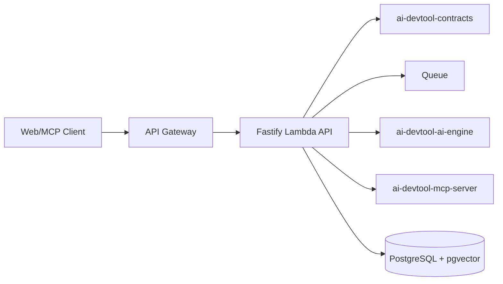
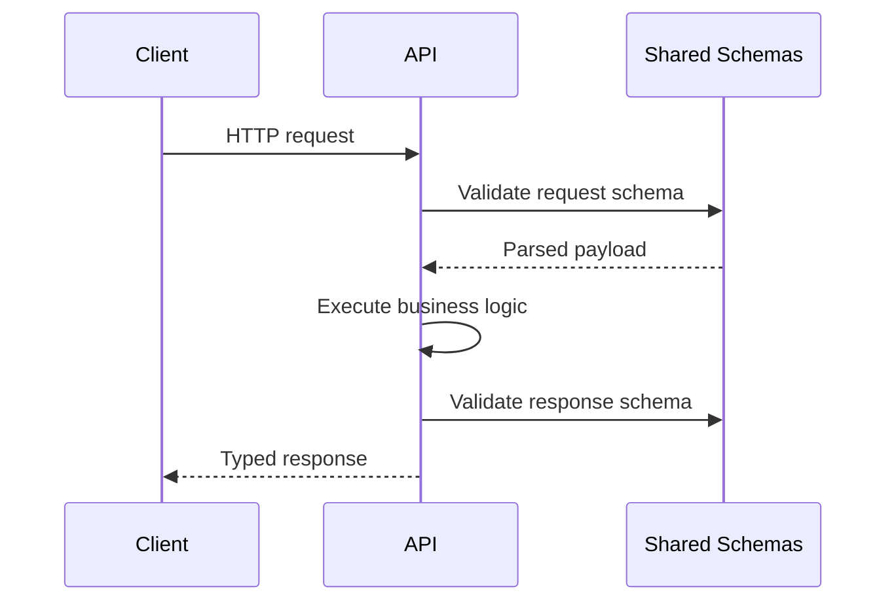

# ai-devtool-api

Node.js Lambda-compatible API for AI DevTool.

## What This Repo Owns
- HTTP API endpoints and request lifecycle.
- Runtime schema validation for request and response payloads.
- Authentication, authorization policy, and orchestration entry points.
- Job submission for indexing/review workloads.

## Bounded Context
- Owns API contracts and orchestration boundaries.
- Does not own long-running execution internals (worker), model implementation (ai-engine), or MCP tool hosting (mcp-server).

## System Design Diagram

## Request Validation Flow

## Standards Implemented
- Runtime schema validation (Zod).
- OpenAPI generation from runtime schemas.
- Structured logging with trace correlation IDs.
- Deterministic error model.

## Repository Layout
- src: handlers, domain services, adapters
- tests: unit and integration tests
- openapi: generated or curated API contract assets
- .github/workflows: checks and deployment pipelines

## Local Development
1. npm install
2. npm run start:dev
3. npm run typecheck
4. npm run test
5. npm run lint

## Runtime Notes
- Default API local address: `http://127.0.0.1:3001`
- Override with env vars:
    - `PORT` (default `3001`)
    - `HOST` (default `127.0.0.1`)

## CI/CD and PR Policy
- Required PR checks: lint, typecheck, unit/integration tests, security scans.
- Deployment workflows: preview, staging, production.
- Dependency audit workflow scheduled weekly.

## Definition of Done for API Changes
- Request and response schemas updated.
- Contract tests added/updated.
- Backward compatibility assessed and documented.
- OpenAPI artifacts regenerated if needed.
